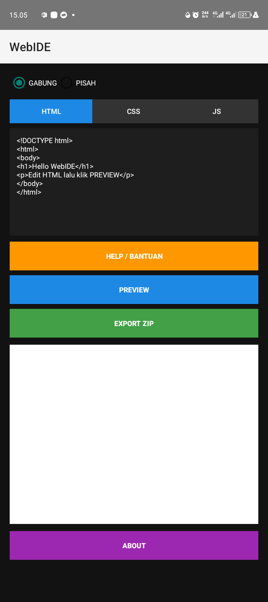

# WebIDE - Mobile HTML/CSS/JS Editor

**Versi:** 1.0  
**Package:** `com.webide.builder`  
**Lisensi:** Apache License 2.0  

---

## Deskripsi
WebIDE adalah aplikasi Android untuk membuat dan mengedit file **HTML, CSS, dan JavaScript** langsung dari HP.  
Cocok buat belajar web, prototipe cepat, atau proyek ringan.  

Fitur utama:
- Mode **Gabung**: HTML, CSS, dan JS digabung di satu file untuk preview cepat.
- Mode **Pisah**: HTML, CSS, dan JS dipisah, siap untuk project serius.
- Preview real-time menggunakan **WebView**.
- Export proyek dalam format **ZIP** langsung ke folder **Download/WebIDE**.
- About & Help untuk informasi aplikasi dan panduan singkat.

---

## Screenshot / Demo

---

## Instalasi
1. Download APK dari [link release / F-Droid].
2. Install di Android (minSdkVersion 14).
3. Buka aplikasi, pilih mode, tulis kode, klik **Preview** atau **Export**.

---

## Changelog
**v1.0**
- Rilis pertama WebIDE
- HTML/CSS/JS editor dengan export ZIP
- Mode Gabung & Pisah
- About & Help screen

---

## Folder Penyimpanan
Proyek yang diexport disimpan di: folder /Download/WebIDE

---

## Lisensi
Apache License 2.0. Selengkapnya baca [LICENSE](LICENSE).

---
